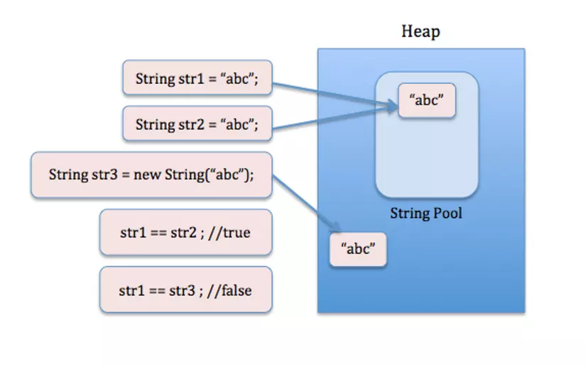

## Sự khác nhau giữa biến nguyên thủy (primitive) và biến tham chiếu (reference)
1. Giới thiệu:
- Biến nguyên thủy (primitive): có 8 kiểu dữ liệu nguyên thủy
   + byte: Biến kiểu byte lưu trữ các giá trị số nguyên từ -128 đến 127. Ví dụ: byte age = 25;
   + short: Biến kiểu short lưu trữ các giá trị số nguyên từ -32,768 đến 32,767. Ví dụ: short temperature = -1000;
   + int: Biến kiểu int lưu trữ các giá trị số nguyên từ -2,147,483,648 đến 2,147,483,647. Ví dụ: int count = 1000;
   + long: Biến kiểu long lưu trữ các giá trị số nguyên từ -9,223,372,036,854,775,808 đến 9,223,372,036,854,775,807. Ví dụ: long population = 7896541230L;
   + float: Biến kiểu float lưu trữ các giá trị số thực dấu phẩy động đến 7 chữ số thập phân. Ví dụ: float weight = 65.5f;
   + double: Biến kiểu double lưu trữ các giá trị số thực dấu phẩy động đến 15 chữ số thập phân. Ví dụ: double pi = 3.14159;
   + char: Biến kiểu char lưu trữ một ký tự Unicode. Ví dụ: char grade = 'A';
   + boolean: Biến kiểu boolean lưu trữ giá trị true hoặc false. Ví dụ: boolean isRaining = true;

- Biến tham chiếu (reference): có năm loại biến tham chiếu chính
  + Lớp (Class): Biến tham chiếu có kiểu dữ liệu là một lớp cụ thể. \
  Ví dụ: 
  ```java
  Person person = new Person();
  ```
  + Interface: Biến tham chiếu có kiểu dữ liệu là một interface. \
  Ví dụ: 
  ```java
  Runnable runnable = new MyRunnable();
  ```
  + Mảng (Array): Biến tham chiếu có kiểu dữ liệu là một mảng. \
  Ví dụ: 
  ```java
  int[] numbers = new int[5];
  ```
  + Enum: Biến tham chiếu có kiểu dữ liệu là một enum. \
  Ví dụ: 
  ```java
  DayOfWeek day = DayOfWeek.MONDAY;
  ```
  + Kiểu dữ liệu tham chiếu khác: Ngoài những loại biến tham chiếu trên, 
  ta còn có thể sử dụng các kiểu dữ liệu tham chiếu khác như String, ArrayList, 
  LinkedList, Map, Set, và nhiều kiểu dữ liệu khác được xây dựng sẵn hoặc tự định nghĩa.\
  ```java
  String name = "John";
  List<Integer> numbers = new ArrayList<>();
  Map<String, Integer> map = new HashMap<>();
  ```
2. Sự khác biệt:
- Biến nguyên thủy (primitive): giá trị của biến được lưu trữ trực tiếp trong bộ nhớ.
Ví dụ:
```java
int a = 5;
int b = a; // Giá trị của a được sao chép sang b
b = 10; // Thay đổi giá trị của b không ảnh hưởng đến a

System.out.println(a); // Output: 5
System.out.println(b); // Output: 10
```

- Biến tham chiếu (reference): Thay vì lưu trữ giá trị trực tiếp, biến tham chiếu chỉ trỏ tới vùng nhớ chứa đối tượng.
Ví dụ:
```java
class MyClass {
    int value;
}

MyClass obj1 = new MyClass();
obj1.value = 5;

MyClass obj2 = obj1; // obj2 trỏ đến cùng đối tượng với obj1
obj2.value = 10; // Thay đổi trạng thái của đối tượng thông qua obj2

System.out.println(obj1.value); // Output: 10
System.out.println(obj2.value); // Output: 10
```

## Một số nội dung liên quan: String, Immutable/Mutable
1. String Pool
- Link nguồn: https://viblo.asia/p/string-pool-la-gi-4dbZNL3L5YM
- String pool là một vùng nhớ đặc biệt nằm trong vùng nhớ Heap (Heap memory), dùng để lưu trữ các biến được khai báo theo kiểu String.
- String pool giúp tối ưu hoá việc lưu trữ và sử dụng vùng nhớ khi khai báo biến String, giúp hạn chế tình trạng tràn bộ nhớ Java Heap Space.

- So sánh String:
  Có 2 cách so sánh string: sử dụng toán tử == và sử dụng phương thức equals().
  - Toán tử == so sánh sự tham chiếu của đối tượng, sự giống nhau về vùng nhớ.
  - Phương thức equals() được override trong lớp String. Nó kiểm tra giá trị của chuỗi kí tự lưu trữ trong string object.

2. Immutable/Mutable:
Các đối tượng hoặc kiểu dữ liệu có thể được chia thành hai loại: immutable (không thể thay đổi) và mutable (có thể thay đổi).
- Immutable: Một đối tượng immutable là một đối tượng mà giá trị của nó không thể thay đổi sau khi được khởi tạo. Khi thực hiện các thao tác trên đối tượng immutable, thay vì thay đổi trực tiếp giá trị của đối tượng, một đối tượng mới được tạo ra để chứa giá trị mới.
Ví dụ về đối tượng immutable là String trong Java. Khi thực hiện các phép toán như nối chuỗi, một đối tượng String mới được tạo ra thay vì thay đổi giá trị của đối tượng ban đầu.
```java
String str1 = "Hello";
String str2 = str1.concat(" World"); // Tạo một đối tượng String mới
System.out.println(str1); // Kết quả: "Hello"
System.out.println(str2); // Kết quả: "Hello World"
```
- Mutable: Một đối tượng mutable là một đối tượng mà giá trị của nó có thể thay đổi sau khi được khởi tạo. Các thay đổi có thể được thực hiện trực tiếp trên đối tượng đó mà không cần tạo ra một đối tượng mới.
Ví dụ về đối tượng mutable là StringBuilder trong Java. Khi thực hiện các phép toán như nối chuỗi, giá trị của đối tượng StringBuilder thay đổi trực tiếp.
```java
StringBuilder sb = new StringBuilder("Hello");
sb.append(" World"); // Thay đổi giá trị của StringBuilder
System.out.println(sb.toString()); // Kết quả: "Hello World"
```
- Lưu ý:
  Phương thức equals() trong lớp StringBuilder thực hiện so sánh giá trị và địa chỉ bộ nhớ của hai đối tượng \
  Vì vậy nếu chỉ so sánh giá trị của hai chuỗi cần sử dụng phương thức toString() để chuyển đổi chúng thành chuỗi String, sau đó sử dụng phương thức equals().
  Ví dụ:
```java
  StringBuilder a = new StringBuilder("a");
  StringBuilder b = new StringBuilder("a");
  if (a.equals(b)){
  System.out.println("equals");
  } else System.out.println("!equals");
  
   a.equals(b) //output: false
```
3. Một số ví dụ:
```java
package org.example;

public class Main {
    public static void main(String[] args) {

        //
        int a = 5;
        int b = a; // Giá trị của a được sao chép sang b
        b = 10;

        System.out.println(a);
        System.out.println(b);

        /
        class MyClass {
            int value;
        }

        MyClass obj1 = new MyClass();
        obj1.value = 5;

        MyClass obj2 = obj1; // obj2 trỏ đến cùng đối tượng với obj1
        obj2.value = 10;

        System.out.println(obj1.value);
        System.out.println(obj2.value);
        
        StringBuilder a = new StringBuilder("abc");
        StringBuilder b = new StringBuilder("abc");
        StringBuilder b = a;

        String a = new String("abc");
        String b = new String("abc");
        System.out.println(a);
        System.out.println(b);
        String b = new String("abc");
        String b = a;

        if (a==b){
            System.out.println("==");
        } else System.out.println("!=");

        if (a.equals(b)){
            System.out.println("equals");
        } else System.out.println("!equals");

        if (a.toString() == b.toString()){
            System.out.println("equals");
        } else System.out.println("!equals");

        StringBuilder number = "a" ;
        test(number);
        System.out.println(number);

    }

    static void test (String a) {
        a = a +"b" ;
    }
}
```

## Lưu ý về truyền tham số kiểu Tham trị
Trong Java, tất cả các tham số của phương thức đều được truyền theo cách tham trị, bất kể kiểu dữ liệu của tham số đó là kiểu nguyên thủy (primitive) hoặc kiểu đối tượng (object).

- Kiểu nguyên thủy (primitive): int: một bản sao của giá trị được tạo ra và được sử dụng trong phương thức, vì vậy không ảnh hưởng đến giá trị ban đầu
- Kiểu đối tượng (object): String: biến tham chiếu chỉ trỏ tới vùng nhớ chứa đối tượng. vì vậy ở đây sẽ copy con trỏ vùng nhớ chứa đối tượng, String là bất biến nên khi thay đổi biến copy này sẽ tạo ra dữ liệu ở vùng nhớ mới, k ảnh hưởng tới vùng nhớ của biến gốc
- `Tuy nhiên` đối với StringBuilder cũng là một lớp dữ liệu có tính chất tham chiếu (reference type): tuy copy vùng nhớ nhưng nó là một lớp có tính thay đổi (mutable), nên khi ta thay đổi biến được copy thì nó sẽ thay đổi trực tiếp giá trị trên vùng nhớ đó, k tạo ra giá trị khác trên vùng nhớ mới, vì vậy sẽ làm thay đổi cả biến gốc


